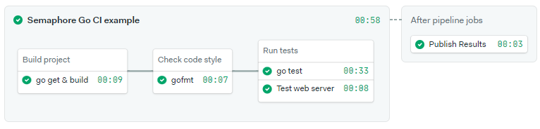

# Semaphore Continuous Integration Golang demo

[](https://semaphore-demos.semaphoreci.com/projects/semaphore-demo-go)

This is an example program and CI pipeline showing how to run a Go project on [Semaphore](https://semaphoreci.com)

## CI on Semaphore

Feel free to fork this repository and use it to [create a Semaphore project][create-project].

The CI pipeline is defined in `.semaphore/semaphore.yml` and when you run it it will look like this:



You can extend the pipeline with deployment by implementing a [promotion][promotions].  Refer to Semaphore documentation for additional [deployment examples][deployment-examples].

## Building the project

The project has been tested with Go 1.19. After cloning the repository:

```bash
$ go get
$ go build -o ./bin/main
```

### Testing locally

To run the tests on you machine:

1. Install `gotestsum`: `go install gotest.tools/gotestsum@latest`
2. Start a test PostgreSQL instance. The easiest way is with Docker: 
    `docker run --rm -d --name test-instance -e POSTGRES_HOST_AUTH_METHOD=trust -p 5432:5432 postgres`
3. Create a test table: `psql -p 5432 -h localhost -U postgres -c "CREATE DATABASE s2"`
4. Run the tests with: `gotestsum`
5. Stop the test database: `docker stop test-instance`

## License

Copyright (c) 2022 Rendered Text

Distributed under the MIT License. See the file LICENSE.

[create-project]: https://docs.semaphoreci.com/guided-tour/getting-started/
[promotions]: https://docs.semaphoreci.com/essentials/deploying-with-promotions/
[deployment-examples]: https://docs.semaphoreci.com/examples/tutorials-and-example-projects/#deployment
