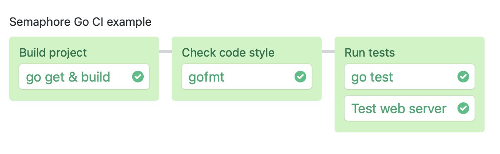

# Semaphore demo CI pipeline using Go

This is an example program and CI pipeline showing how to run a Go project on
Semaphore 2.0.

## CI on Semaphore

Feel free to fork this repository and use it to [create a
Semaphore project][create-project].

The CI pipeline is defined in `.semaphore/semaphore.yml` and when you run it it
will look like this:

You can extend the pipeline with deployment by implementing a
[promotion][promotions].  Refer to Semaphore documentation for additional
[deployment examples][deployment-examples].

## License

Copyright (c) 2019 Rendered Text

Distributed under the MIT License. See the file LICENSE.

[create-project]: https://docs.semaphoreci.com/article/63-your-first-project
[promotions]: https://docs.semaphoreci.com/article/67-deploying-with-promotions
[deployment-examples]: https://docs.semaphoreci.com/article/123-tutorials-and-example-projects#deployment
